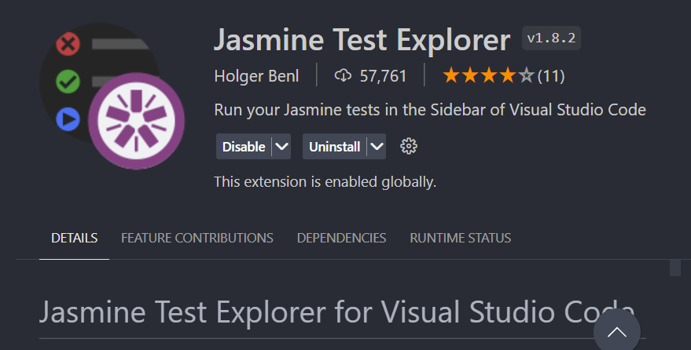
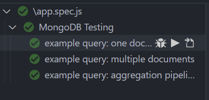

To Access the testing method, use Jasmine 

Test Explore

Restart VS Code to see Test Samples

This lab utilizes mongodb and Node.js

There are three sample query methods available:
1. single document query with findOne()
2. multiple document query with find()
3. aggregation pipeline with aggregrate()

*Note: as aggregation pipeline, as mongodb claims, provides better usability than map-reduce, I have created an example query using it.*